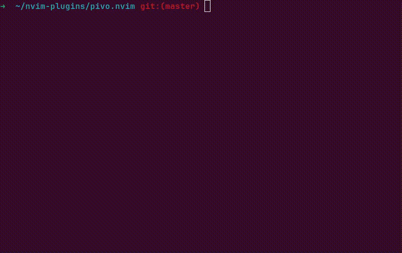

# pivo.nvim

## What is Pivo?

`pivo.nvim` is a simple plugin for encrypting your files with `gpg`.



## Requirements

`gpg` - for crypto stuff.

## Installation

Using [lazy.nvim](https://github.com/folke/lazy.nvim)

```lua
-- init.lua:
{
    "https://github.com/markbragin/pivo.nvim",
}

-- plugins/pivo-nvim.lua:
return {
    "https://github.com/markbragin/pivo.nvim",
    --- config = function()
    ---     require("pivo")
    --- end
}
```

## Usage

- `:PivoNew <filename>` - creates _filename.gpg_ encrypted file;
- `:PivoEncrypt` - encrypts current file (_filename_ -> _filename.gpg_)
- `:PivoDecrypt` - decrypts current file (_filename.gpg_ -> _filename_);
- `:PivoLock` - locks (encrypts) decrypted file in buffer;
- `:PivoUnlock` - unlocks (decrypts) encrypted file in buffer;

By default when opening encrypted files vim prompts you for password and decrypts
it to vim buffer not to disk.

